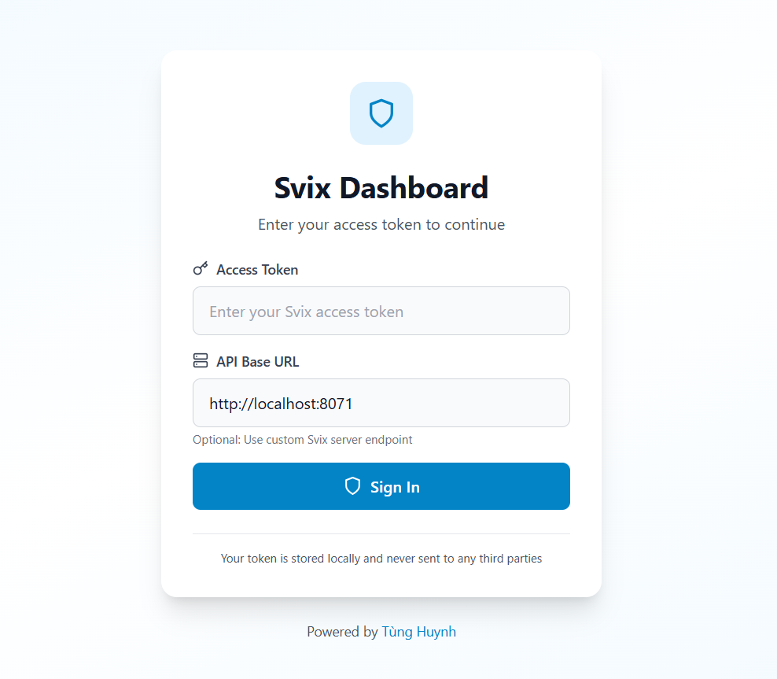
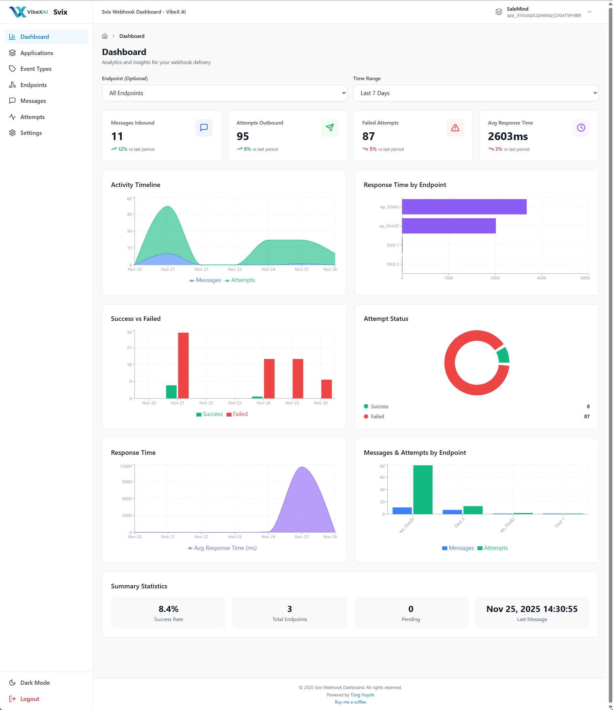

# Svix Webhook Management Dashboard

A comprehensive, professional-grade web application for managing Svix webhooks. Built with React, Tailwind CSS, and React Query, this dashboard provides a complete interface for webhook operations with advanced features and analytics.

## Demo live

[https://tunghuynh.net/svix-webhook-dashboard](https://tunghuynh.net/svix-webhook-dashboard)

## Automation Test report

[Test Report](./res/11bae86a-c369-44ee-8d36-9400e9df1db5/test_report.md)

## 📸 Screenshots

### Login


### Light Mode


### Dark Mode


## ✨ Features

### 🔐 Authentication
- Secure login with Svix access token
- Custom API endpoint configuration
- Persistent session management

### 📱 Applications Management
- Create, read, update, and delete applications
- Custom metadata support
- Rate limiting configuration
- Advanced search and filtering
- Pagination for large datasets
- System config application (auto-hidden from UI)

### 🏷️ Event Types Management
- Full CRUD operations for event types
- JSON schema validation support
- Archive/active status management
- Event type descriptions and feature flags
- Pagination support

### 🎯 Endpoints Management
- Complete endpoint lifecycle management
- **Unified Config Page**: Edit endpoint settings directly in the configuration page (no separate edit modal)
- Event type filtering per endpoint
- Channel configuration
- Enable/disable endpoints
- Version management
- Rate limiting per endpoint
- Advanced configuration page with tabs:
  - **Settings**: Edit all endpoint properties (URL, description, version, status, filters, channels)
  - **Headers**: Custom headers management
  - **Secret**: Webhook secret viewing and rotation
  - **Statistics**: Performance metrics and monitoring

### 📨 Messages & Testing
- Send webhook messages with custom payloads
- JSON payload validation
- Channel targeting
- Event type selection
- Message history and details
- Copy message data to clipboard
- Pagination support
- URL parameter filtering

### 📊 Advanced Dashboard & Analytics
- **Real-time Statistics**: Messages, Attempts, Failed Attempts, Avg Response Time
- **Timeline Charts** (3 vertical charts):
  - Activity Timeline (Messages & Attempts over time)
  - Success vs Failed attempts
  - Response Time trends
- **Distribution Charts** (3 vertical charts):
  - Response Time by Endpoint (horizontal bar chart)
  - Attempt Status distribution (pie chart)
  - Messages & Attempts by Endpoint (grouped bar chart)
- Time range filtering (24h, 7d, 30d)
- Endpoint-specific analytics
- Recharts integration for professional visualizations

### 📝 Monitoring & Logs
- Real-time delivery attempt tracking
- Success/failure/pending status filtering
- Response time monitoring
- HTTP status code tracking
- Retry failed deliveries
- Detailed attempt logs with responses
- URL parameter filtering (msgId, endpointId)

### 🎨 Brand Customization
- **Server-Side Configuration Storage**: Brand settings saved to Svix API (no local storage)
- Customizable brand name and header title
- Custom logo support (light & dark mode)
- Auto-sync across all sessions
- Reset to default option

### 🎨 UI/UX
- Beautiful, modern interface
- **Dark mode support** with persistent theme
- **Fully responsive** (mobile, tablet, desktop)
- Global application selector with auto-sync
- Breadcrumb navigation
- Loading states and error handling
- Toast notifications
- Professional color scheme
- Pagination for large datasets
- Smooth page transitions
- Optimized performance with React Query caching
- Custom footer

## 🚀 Quick Start

### Installation

```bash
npm install
```

### Development

```bash
npm run dev
```

Open your browser at `http://localhost:5173`

### Build for Production

```bash
npm run build
```

### Preview Production Build

```bash
npm run preview
```

## 📋 Requirements

- Node.js 16+
- npm or yarn
- Svix account and access token

## ✅ Tested On

This dashboard has been tested and confirmed to work stably with:
- **[svix/svix-server:v1](https://hub.docker.com/layers/svix/svix-server/v1/images/sha256-f3afa1cf85e998979a04c8f4c75724678d7a8b234f7510030d2f8c8f5157b017)** (Docker)

The application uses Svix's standard OpenAPI specification for all API operations. See [SvixOpenAPI.json](./res/SvixOpenAPI.json) for complete API documentation.

## 🔧 Configuration

### Getting Your Svix Access Token

```
docker exec -it svix-server svix-server jwt generate org_<your-custom-id>
```

### System Configuration

The dashboard automatically stores system configuration (brand settings) in a special Svix application with UID `app-system-config`. This application is:
- Automatically created on first brand customization
- Hidden from the applications list and selectors
- Used to persist brand settings across sessions
- Synced via Svix API (no local storage needed)

You can configure the system config UID in `src/utils/constants.js`:

```javascript
export const SYSTEM_CONFIG = {
  APP_UID: 'app-system-config',
  APP_NAME: 'System Configuration',
}
```

## 🏗️ Project Structure

```
svix-sample/
├── src/
│   ├── components/           # Reusable UI components
│   │   ├── ApplicationCard.jsx
│   │   ├── ApplicationModal.jsx
│   │   ├── AppSelector.jsx         # Global app selector
│   │   ├── AttemptCard.jsx
│   │   ├── AttemptTable.jsx
│   │   ├── AttemptDetailModal.jsx
│   │   ├── Breadcrumbs.jsx         # Navigation breadcrumbs
│   │   ├── ConfirmDialog.jsx
│   │   ├── CopyButton.jsx          # Icon-only copy button
│   │   ├── EndpointCard.jsx        # Removed edit button
│   │   ├── EndpointModal.jsx
│   │   ├── EventTypeCard.jsx
│   │   ├── EventTypeModal.jsx
│   │   ├── Footer.jsx              # Custom footer
│   │   ├── MessageCard.jsx
│   │   ├── MessageTable.jsx
│   │   ├── MessageModal.jsx
│   │   ├── MessageDetailDrawer.jsx
│   │   └── Pagination.jsx
│   ├── hooks/                # Custom React hooks
│   │   ├── useApplications.js
│   │   ├── useEndpoints.js   # Enhanced with headers, secrets, stats
│   │   ├── useEventTypes.js
│   │   └── useMessages.js
│   ├── layouts/              # Page layouts
│   │   └── DashboardLayout.jsx  # With dark mode, app selector, breadcrumbs
│   ├── pages/                # Main pages
│   │   ├── ApplicationsPage.jsx    # With pagination, system app filtering
│   │   ├── AttemptsPage.jsx        # With URL filtering
│   │   ├── DashboardPage.jsx       # Advanced analytics with 6 charts
│   │   ├── EndpointConfigPage.jsx  # Unified config with 4 tabs
│   │   ├── EndpointsPage.jsx
│   │   ├── EventTypesPage.jsx
│   │   ├── LoginPage.jsx
│   │   ├── MessagesPage.jsx        # With pagination, URL filtering
│   │   └── SettingsPage.jsx        # API-based brand config
│   ├── services/             # API services
│   │   ├── api.js                  # Svix API client
│   │   └── systemConfig.js         # Brand config storage
│   ├── store/                # State management
│   │   ├── appStore.js             # Global app selection
│   │   ├── authStore.js            # Authentication
│   │   └── brandStore.js           # Brand customization (API-based)
│   ├── utils/                # Utility functions
│   │   ├── appFilter.js            # Filter system applications
│   │   ├── constants.js            # System constants
│   │   └── helpers.js              # Helper functions
│   ├── App.jsx               # Main app component with config loader
│   ├── main.jsx              # App entry point
│   └── index.css             # Global styles
├── public/
├── .env.example
├── .gitignore
├── index.html
├── package.json
├── tailwind.config.js
├── vite.config.js
└── README.md
```

## 🛠️ Technology Stack

- **Frontend Framework**: React 18
- **Routing**: React Router v6
- **Styling**: Tailwind CSS with dark mode
- **HTTP Client**: Axios
- **State Management**: Zustand
- **Data Fetching**: TanStack React Query
- **Form Handling**: React Hook Form
- **Charts**: Recharts
- **Icons**: Lucide React
- **Notifications**: React Hot Toast
- **Date Formatting**: date-fns
- **Build Tool**: Vite

## 🎯 Key Features Implemented

✅ Authentication with access tokens
✅ Full CRUD for Applications
✅ Full CRUD for Event Types
✅ Full CRUD for Endpoints
✅ **Unified endpoint configuration** (edit in config page)
✅ Custom headers management per endpoint
✅ Webhook secret rotation
✅ Endpoint performance statistics
✅ **Advanced dashboard with 6 charts**
✅ Message sending and testing
✅ Delivery attempt monitoring
✅ Status filtering and search
✅ Retry mechanism for failed deliveries
✅ Pagination for all list views
✅ **Dark mode** support
✅ **Brand customization** (API-based storage)
✅ **Global app selector**
✅ **Breadcrumb navigation**
✅ **URL parameter filtering**
✅ Responsive design
✅ Error handling
✅ Loading states
✅ Toast notifications
✅ Optimized caching with React Query

## 📝 API Coverage

This dashboard implements the following Svix API endpoints:

- **Applications**: List, Get, Create, Update, Delete
  - Used for brand config storage (system app)
  - Filtered from UI using UID
- **Event Types**: List, Get, Create, Update, Delete
- **Endpoints**: List, Get, Create, Update, Delete
- **Headers**: Get, Update
- **Secrets**: Get, Rotate
- **Stats**: Get endpoint statistics
- **Messages**: List, Get, Create
- **Attempts**: List by Endpoint, List by Message, Get, Resend

## 🔮 Architecture Highlights

### Brand Configuration System
- **Storage**: Svix Application API (metadata field)
- **Special App**: UID `app-system-config` (configurable)
- **Auto-sync**: Loads on authentication, saves on change
- **Filtering**: Automatically excluded from UI
- **Benefits**: No localStorage, works across devices, survives cache clear

### State Management
- **Zustand**: Lightweight, no boilerplate
- **React Query**: Server state caching, optimistic updates
- **Global App Selection**: Persisted selection across pages
- **Brand Store**: API-backed, async operations

### UI/UX Patterns
- **Unified Config**: Single page for all endpoint settings
- **Icon-only buttons**: Clean, minimal interface
- **Smart filtering**: URL params for deep linking
- **Responsive charts**: 6 charts with adaptive layouts
- **Dark mode**: System preference + manual toggle

## 🔒 Security Notes

- Access tokens stored in localStorage with Zustand persist
- API calls authenticated with Bearer token
- System config app hidden from normal operations
- No sensitive data in client-side code

## 📄 License

This project is open source and available under the MIT License. See [LICENSE.md](./LICENSE.md) for details.

You are free to fork and customize this dashboard for your own needs. If you do, please keep the LICENSE.md file in your repository.

## 🙏 Acknowledgments

- Built with [Svix](https://www.svix.com) - The enterprise-ready webhooks service
- UI inspired by modern SaaS dashboards
- Icons by [Lucide](https://lucide.dev)
- Charts by [Recharts](https://recharts.org)

## 👨‍💻 Credits

Powered by **[Tùng Huynh](https://tunghuynh.net)**

If you find this project helpful, consider supporting the development:

<a href="https://buymeacoffee.com/tunghuynhts" target="_blank"></a>

## 📞 Support

- For Svix API questions, visit [Svix Documentation](https://docs.svix.com)
- For dashboard issues, please open an issue on GitHub

---

Made with ❤️ for the webhook community by [Tùng Huynh](https://tunghuynh.net)
